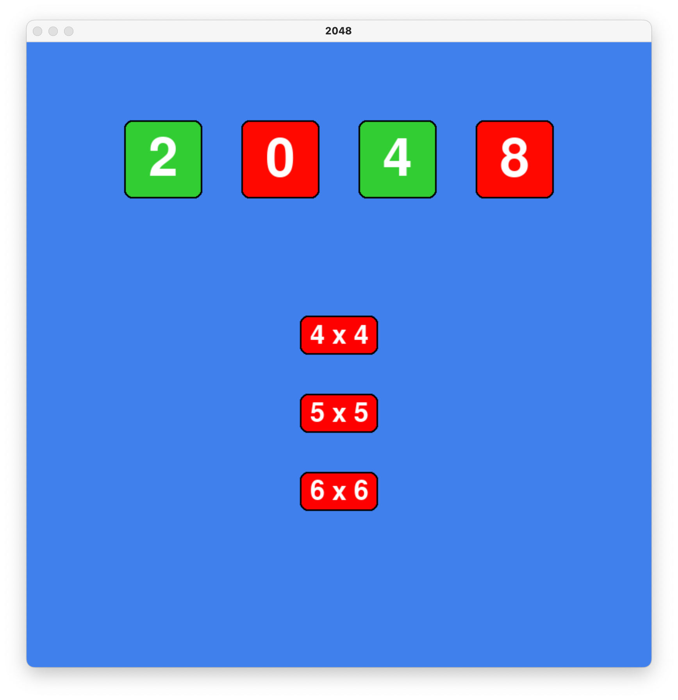
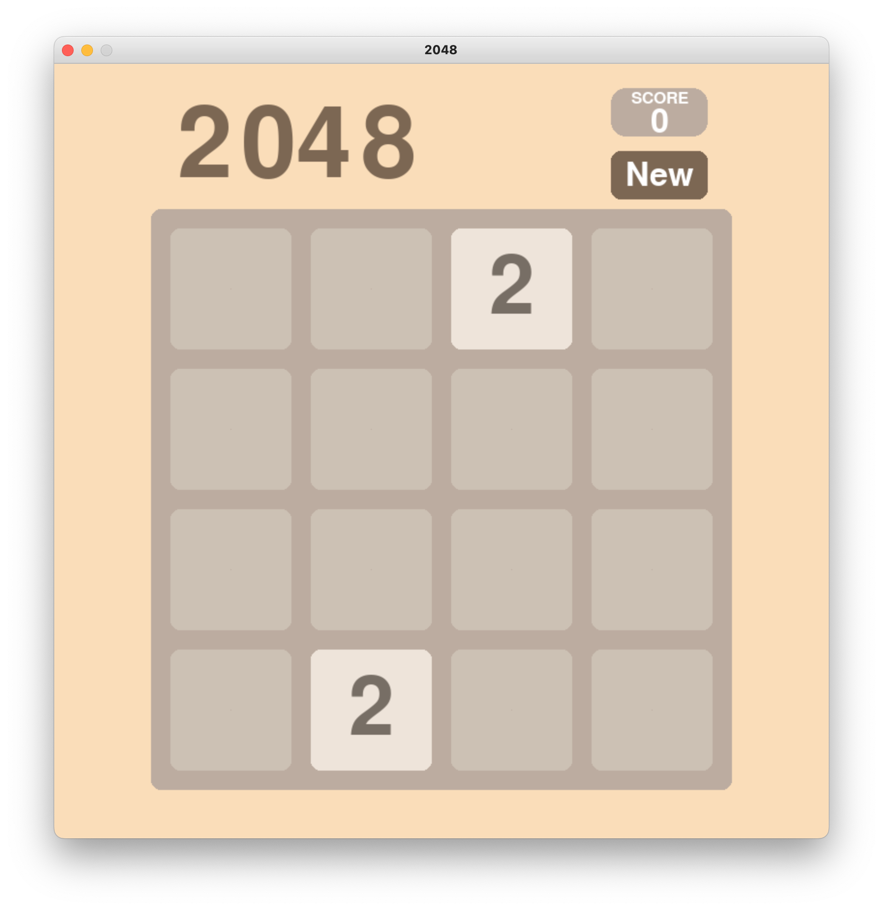
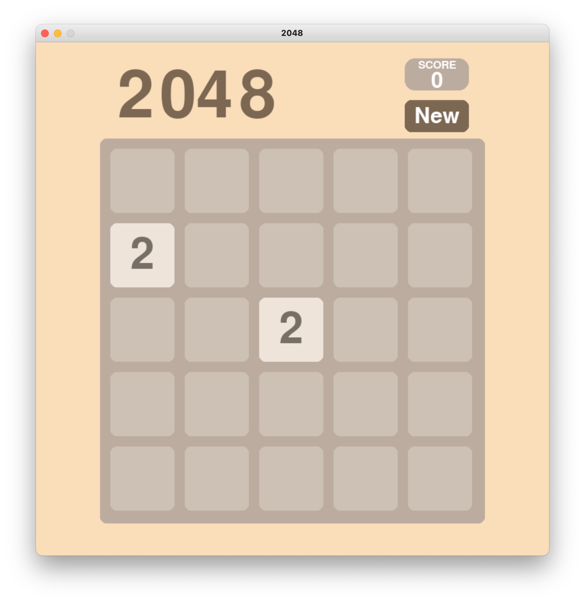
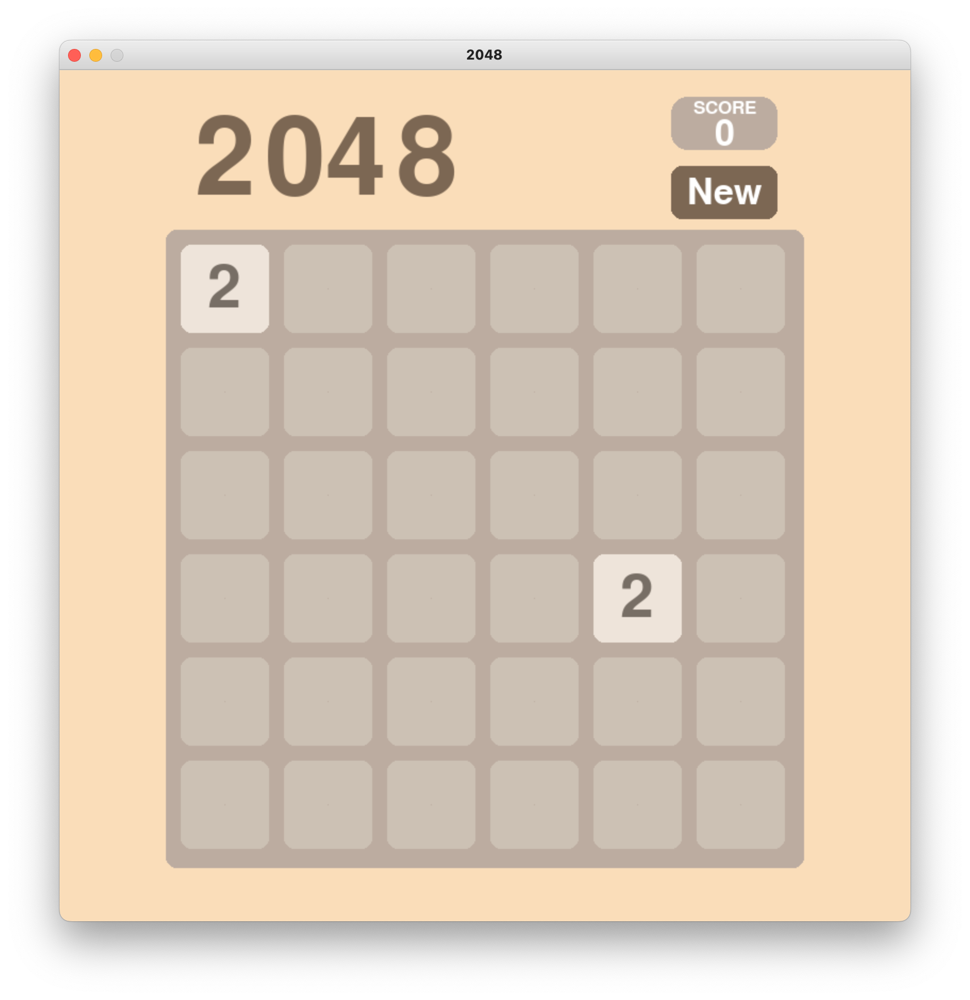
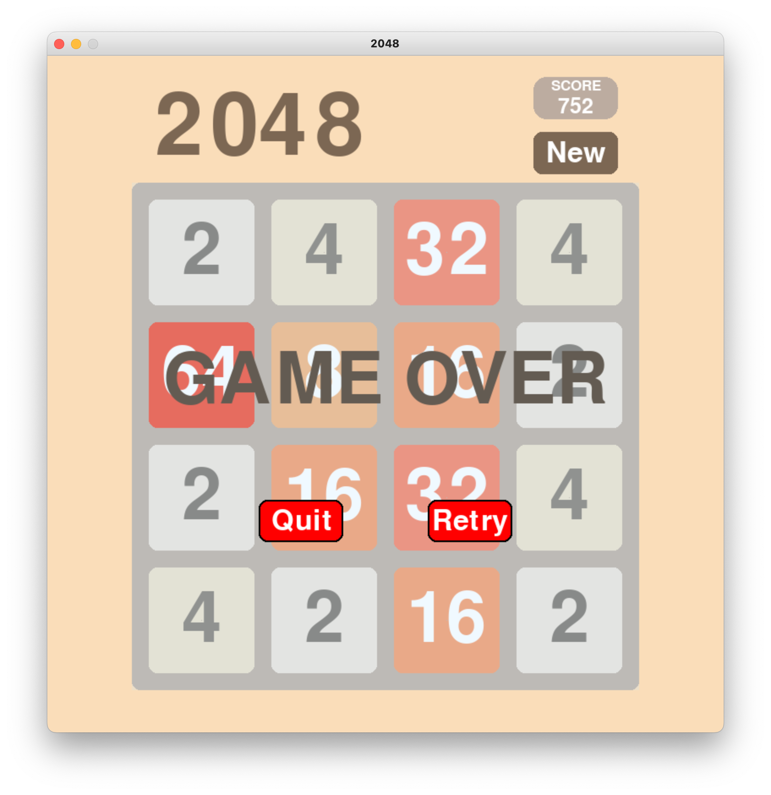

# 2048
## Overview
This program is a variant of the classic [2048](https://en.wikipedia.org/wiki/2048_(video_game)) Video Game.

## Gameplay
To start, choose the size of the game board.

### 4x4 Board

### 5x5 Board

### 6x6 Board

Use the arrow keys to shift and combine tiles!
* You can only combine tiles that are of equal value
* You can only shift tiles if there is space on the board

**Goal: Try to get 2048**

If the board becomes too full, try to get rid of some tiles, if you can't, GAME OVER.



## Installation Instructions
Download the repository

```
git clone https://github.com/pmorales01/2048.git
```

Install Pygame
```
pip install pygame
```

Go to the repo folder
```
cd 2048/
```

Execute run.py to play the game
```
./run.py
```
